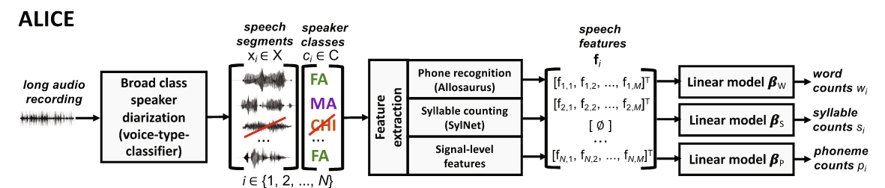

# Automatic LInguistic Unit Count Estimator (ALICE)



### Introduction

ALICE is a tool for estimating the number of adult-spoken linguistic units from child-centered audio
recordings, as captured by microphones worn by children. It is meant as an open-source alternative
for LENA <tm> adult word count (AWC) estimator [1].

ALICE uses SylNet [[2]](https://github.com/shreyas253/SylNet) for feature extraction and voice type classifier [[3]](https://github.com/MarvinLvn/voice-type-classifier) for broad-class speaker
diarization. The used model for linguistic unit counts has been optimized across four languages:
Argentinian Spanish, Tseltal, Yélî Dnye, and American and UK variants of English. SylNet uses a model that
has been adapted for daylong child-centered audio, starting from the baseline model available
in standard SylNet.

ALICE outputs an estimate for the number of phonemes, syllables, and words in the input. Only
speech detected as spoken by adult male or female talkers is considered towards the counts.

Unit counts from ALICE are not (and are not meant to be) accurate at short time-scales,
but optimized for counting across several minutes of audio. Also note that ALICE is NOT
designed for "typical" high-quality audio recordings, and may
not operate on such data properly.

### How to use ?

1) [Installation](./docs/installation.md)
2) [Usage](./docs/usage.md)
3) [Demo & installation verification](./docs/demo.md)
4) [Common problems](./docs/debugging.md)   
5) [Patch notes](./docs/patch_notes.md)
6) [License](./docs/license.md)
7) [Related tools](./docs/related_tools.md)

### How to cite ?

If you use ALICE or it's derivatives, please cite the following paper:

```text
Räsänen, O., Seshadri, S., Lavechin, M., Cristia, A. & Casillas, M. (in press): ALICE: An open-source tool
for automatic linguistic unit count estimation from child-centered daylong recordings. Behavior Research Methods. 
Online open acccess: https://link.springer.com/article/10.3758/s13428-020-01460-x.
```

### References

```text
[1] Xu, D., Yapanel, U. Gray, S., Gilkerson, J., Richards, J. Hansen, J. (2008).
    Signal processing for young child speech language development
    Proceedings of the 1st Workshop on Child Computer and Interaction (WOCCI-2008), Chania, Crete, Greece.
    (https://www.lena.org/)

[2] Seshadri S. & Räsänen O. (2019). SylNet: An Adaptable End-to-End Syllable Count Estimator for Speech.
    IEEE Signal Processing Letters, vol 26, pp. 1359--1363  (https://github.com/shreyas253/SylNet)

[3] Lavechin, M.: Voice-type-classifier (https://github.com/MarvinLvn/voice-type-classifier)
```